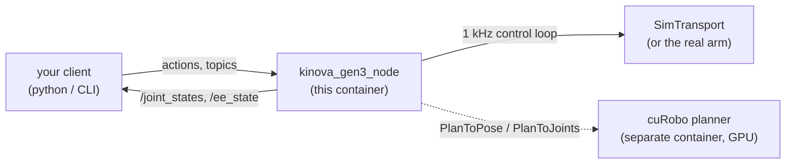
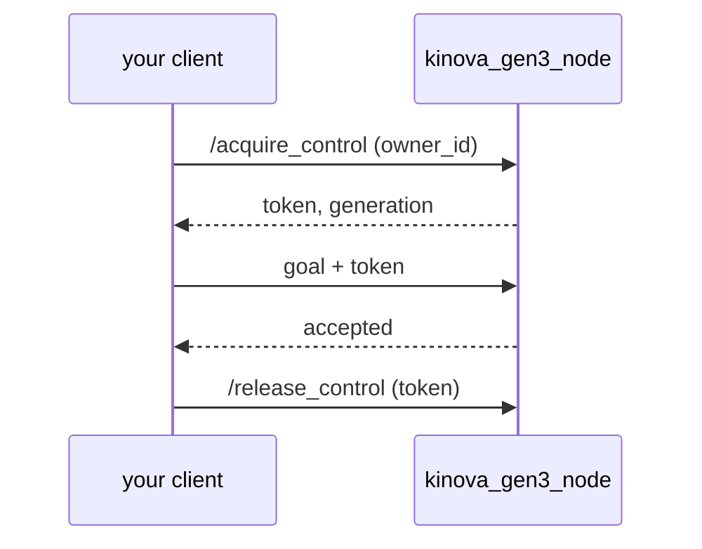

# Getting started

One worked example, start to finish: **bring up a simulated arm and move a joint.**
No hardware, no GPU, no ROS installed on your machine — just Docker. Everything here
runs the same way against the real arm later; only one flag changes.

## What you are talking to



The driver is one container. Inside it, a 1 kHz real-time loop talks to the arm; the
ROS layer never touches that loop directly. In sim, `SimTransport` stands in for the
hardware and behaves the same from the outside.

The dashed arrow is the part that catches people out. **The planner is a second
container, and this image does not contain it** — it holds only the cuRobo message
definitions, not cuRobo. The driver is a *client* of the planner, which needs a GPU
and has no business inside a real-time container.

Everything below runs on the driver alone. The `go_to_*` actions do not — see
[Planned moves need both containers](#planned-moves-need-both-containers).

## 1. Start the arm

```sh
docker run --rm -it --network host --ipc host \
  -e RMW_IMPLEMENTATION=rmw_cyclonedds_cpp \
  ghcr.io/rammp-org/kinova-gen3-ros2:1.0.0
```

You should see:

```
[kinova_gen3_node]: kinova_gen3_node up (sim); arbitration=disabled;
  actions: /execute_joint_trajectory, /go_to_ee_pose, ...
```

`--network host` and `--ipc host` are not optional: DDS needs both to reach your
shell. `RMW_IMPLEMENTATION` must match in **every** shell you use — see
[Troubleshooting](../troubleshooting) for what happens when it doesn't.

## 2. Check it is alive

In a second shell:

```sh
export RMW_IMPLEMENTATION=rmw_cyclonedds_cpp
ros2 topic echo --once --qos-reliability best_effort /joint_states
```

**That `--qos-reliability best_effort` is required.** `/joint_states` is published
best-effort at ~100 Hz. Without the flag `ros2 topic echo` prints nothing at all and
looks broken — this is the single most common first stumble.

You should get seven joint positions.

## 3. Move a joint

The lowest tier is `execute_joint_trajectory`: you give the waypoints, the driver
tracks them. Seed waypoint 0 from where the arm *is*, then move one joint a little:

```sh
ros2 action send_goal /execute_joint_trajectory \
  rammp_arm_interfaces/action/ExecuteJointTrajectory \
  "{trajectory: {points: [
      {positions: [0,0.26,3.14,-2.27,0,0.96,1.57], time_from_start: {sec: 0}},
      {positions: [0,0.26,3.14,-2.27,0,1.21,1.57], time_from_start: {sec: 3}}
    ]}, control_mode: 0, preemption: 1}" --feedback
```

That moves joint 6 by 0.25 rad over three seconds. Watch `error_code` in the result:
`0` is success. Anything else is listed in the
[interface reference](../interface).

> **Always seed waypoint 0 from the arm's measured position.** On a real arm a
> trajectory that starts somewhere else is a jump, not a move.

## 4. Turn arbitration on

Everything above ran with `arbitration=disabled`, where anyone may command the arm.
Real deployments run **enforced**, where every goal carries a capability token:



Restart the node with `--ros-args -p arbitration_mode:=enforced`, then call
`/acquire_control` and put the returned token on every goal. A goal without it is
**refused**, which is the second most common stumble.

`arbitration_mode` is read-only at launch — setting it on a running node silently
does nothing.

## Planned moves need both containers

Everything so far used the driver alone. The three `go_to_*` actions do not: they say
*where*, not *how*, and something has to work out the *how*. That something is the
cuRobo planner, in its own container.

| you call | needs the planner? |
| --- | --- |
| `/execute_joint_trajectory` — you supply the path | no |
| `/setpoint/*` streaming, `/setpoint/gripper` | no |
| `/acquire_control`, `/estop`, all state topics | no |
| `/go_to_joint_config`, `/go_to_ee_pose`, `/go_to_preset` | **yes** |

Send a `go_to_*` goal with no planner running and it is accepted and then simply
never finishes — there is nothing to plan it. That is the single most confusing way
this driver can fail, and it is not your client's fault.

### The fleet way

On a RAMMP machine, `sheppy` reads this module's `rammp-alternative*.yaml` fragments
and starts both containers with the right flags. You should not have to think about
any of what follows.

### Doing it yourself

Off-fleet, run both with compose. Save this as `compose.yaml`:

```yaml
services:
  kinova_gen3_driver:
    image: ghcr.io/rammp-org/kinova-gen3-ros2:1.0.0
    network_mode: host
    ipc: host                      # DDS shared-memory transport
    cap_add: [SYS_NICE]            # permits sched_setscheduler...
    ulimits:                       # ...and these let it SUCCEED. Capabilities
      rtprio: 99                   # are not rlimits, and --privileged does NOT
      memlock: -1                  # raise RLIMIT_RTPRIO. Both are required.
    environment:
      RMW_IMPLEMENTATION: rmw_cyclonedds_cpp
    command:
      - /ros2_ws/install/kinova_gen3_ros2/lib/kinova_gen3_ros2/kinova_gen3_node
      - --ip
      - ${KINOVA_ARM_IP:-192.168.1.10}   # drop these two lines for --sim
      - --urdf
      - /ros2_ws/src/kinova-gen3-driver/models/gen3_7dof_2f85.urdf

  curobo_planner:
    image: rammp-curobo:jp6        # owned by rammp-org/RAMMP-CuRobo
    runtime: nvidia                # JetPack exposes the GPU this way, NOT --gpus
    network_mode: host
    ipc: host
    environment:
      RMW_IMPLEMENTATION: rmw_cyclonedds_cpp
```

```sh
KINOVA_ARM_IP=192.168.1.10 docker compose up
```

Three things here are load-bearing and not stylistic:

- **`ipc: host` and `network_mode: host`** on *both* — without them the two
  containers cannot see each other's DDS traffic, and neither can your shell.
- **`cap_add: SYS_NICE` *and* the `ulimits`.** The capability permits
  `sched_setscheduler`; the rlimits are what let it succeed. `--privileged` raises
  the first and not the second, so it is not a substitute.
- **`runtime: nvidia`**, not `--gpus`, on JetPack.

The version of this file the fleet actually runs lives at `deploy/compose.yaml` in
the repo. It differs on purpose: it builds images locally rather than pulling them.

## Where to go next

- **[Interface reference](../interface)** — every topic, action, service, with units.
- **[Planned moves](../guide-goto-actions)** — say *where*, not *how*. Needs the
  planner container as well; see [above](#planned-moves-need-both-containers).
- **[Troubleshooting](../troubleshooting)** — read this the first time something
  looks broken.

## Before you touch the real arm

Change `--sim` to `--ip <arm-address>` and everything above works the same. But read
the safety notes in [Troubleshooting](../troubleshooting) first, and have the e-stop
in hand — a real arm moves whether or not your maths was right.
