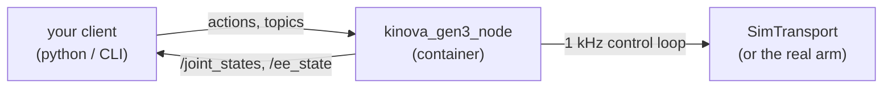
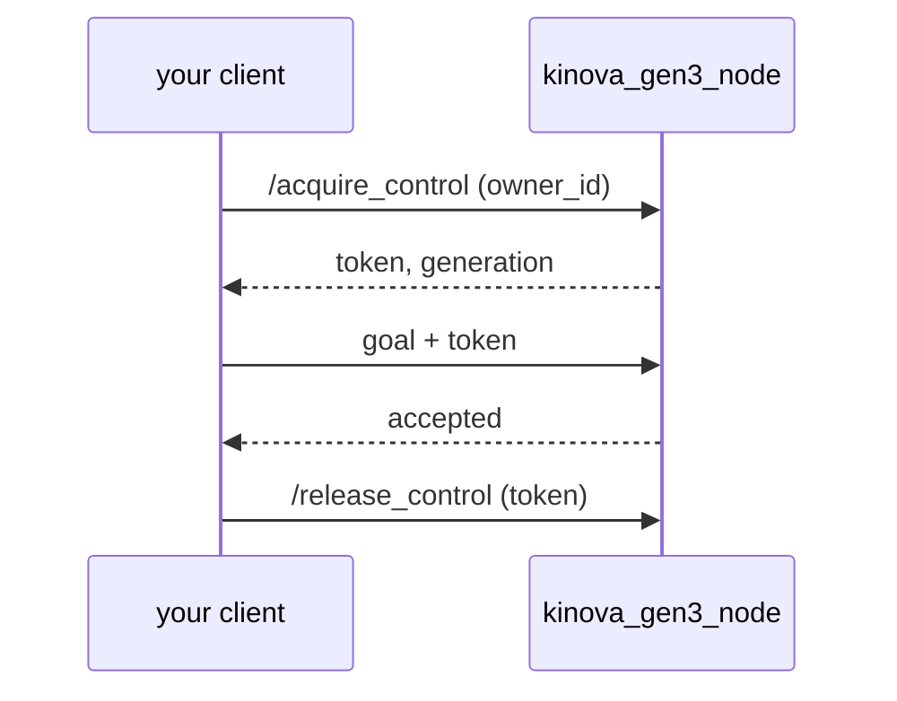

# Getting started

One worked example, start to finish: **bring up a simulated arm and move a joint.**
No hardware, no GPU, no ROS installed on your machine — just Docker. Everything here
runs the same way against the real arm later; only one flag changes.

## What you are talking to



One container holds the driver. Inside it, a 1 kHz real-time loop talks to the arm;
the ROS layer never touches that loop directly. In sim, `SimTransport` stands in for
the hardware and behaves the same from the outside.

## 1. Start the arm

```sh
docker run --rm -it --network host --ipc host \
  -e RMW_IMPLEMENTATION=rmw_cyclonedds_cpp \
  ghcr.io/rammp-org/kinova-gen3-ros2:main
```

You should see:

```
[kinova_gen3_node]: kinova_gen3_node up (sim); arbitration=disabled;
  actions: /execute_joint_trajectory, /go_to_ee_pose, ...
```

`--network host` and `--ipc host` are not optional: DDS needs both to reach your
shell. `RMW_IMPLEMENTATION` must match in **every** shell you use — see
[Troubleshooting](../troubleshooting) for what happens when it doesn't.

## 2. Check it is alive

In a second shell:

```sh
export RMW_IMPLEMENTATION=rmw_cyclonedds_cpp
ros2 topic echo --once --qos-reliability best_effort /joint_states
```

**That `--qos-reliability best_effort` is required.** `/joint_states` is published
best-effort at ~100 Hz. Without the flag `ros2 topic echo` prints nothing at all and
looks broken — this is the single most common first stumble.

You should get seven joint positions.

## 3. Move a joint

The lowest tier is `execute_joint_trajectory`: you give the waypoints, the driver
tracks them. Seed waypoint 0 from where the arm *is*, then move one joint a little:

```sh
ros2 action send_goal /execute_joint_trajectory \
  kinova_gen3_interfaces/action/ExecuteJointTrajectory \
  "{trajectory: {points: [
      {positions: [0,0.26,3.14,-2.27,0,0.96,1.57], time_from_start: {sec: 0}},
      {positions: [0,0.26,3.14,-2.27,0,1.21,1.57], time_from_start: {sec: 3}}
    ]}, control_mode: 0, preemption: 1}" --feedback
```

That moves joint 6 by 0.25 rad over three seconds. Watch `error_code` in the result:
`0` is success. Anything else is listed in the
[interface reference](../interface).

> **Always seed waypoint 0 from the arm's measured position.** On a real arm a
> trajectory that starts somewhere else is a jump, not a move.

## 4. Turn arbitration on

Everything above ran with `arbitration=disabled`, where anyone may command the arm.
Real deployments run **enforced**, where every goal carries a capability token:



Restart the node with `--ros-args -p arbitration_mode:=enforced`, then call
`/acquire_control` and put the returned token on every goal. A goal without it is
**refused**, which is the second most common stumble.

`arbitration_mode` is read-only at launch — setting it on a running node silently
does nothing.

## Where to go next

- **[Interface reference](../interface)** — every topic, action, service, with units.
- **[Planned moves](../guide-goto-actions)** — say *where*, not *how*. Needs the
  planner container as well.
- **[Troubleshooting](../troubleshooting)** — read this the first time something
  looks broken.

## Before you touch the real arm

Change `--sim` to `--ip <arm-address>` and everything above works the same. But read
the safety notes in [Troubleshooting](../troubleshooting) first, and have the e-stop
in hand — a real arm moves whether or not your maths was right.
