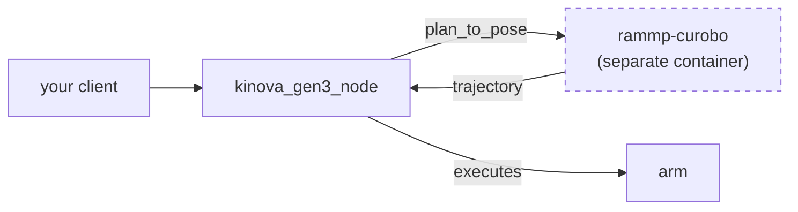

# Troubleshooting

Every entry here is a real failure someone hit. They share a shape: the system looks
broken, or worse looks fine, and the cause is somewhere you would not think to look.

## Nothing is published — or so it seems

```sh
$ ros2 topic echo /joint_states
# ...nothing, forever
```

`/joint_states`, `/ee_state` and `/gripper_state` are **best-effort** QoS. A default
`ros2 topic echo` subscribes reliable, the QoS does not match, and you get silence
that looks exactly like a dead publisher.

```sh
ros2 topic echo --qos-reliability best_effort /joint_states   # works
```

`/control_status` and `/stream_status` are the opposite — reliable and *latched*, so
they deliver the current value to a late subscriber. If one looks stale, you are
probably reading a cached sample; re-subscribe rather than waiting.

## A goal is accepted and then nothing happens, forever

The `go_to_*` actions are clients of the cuRobo planner. If the planner is not
running, the goal is accepted and sits in `phase=planning` indefinitely.



**Both containers must be running.** `deploy/compose.yaml` declares them together.
`ros2 action list` should show `/rammp_curobo/plan_to_pose` as well as the
`/go_to_*` actions.

The same symptom has a second cause: **an RMW mismatch.** If the planner runs
CycloneDDS and your client runs the default FastRTPS, discovery *partly* succeeds —
`ros2 action list` shows the actions — but goals are never answered. A
`RTPS_READER_HISTORY ... payload size` line in the log is the tell. Export
`RMW_IMPLEMENTATION=rmw_cyclonedds_cpp` in every shell.

## Every goal is refused

You are running `arbitration_mode:=enforced` without a token. Call
`/acquire_control` and put the returned token on every goal — see
[Getting started](../getting-started).

Check `/control_status`: `owned` tells you whether anyone holds the arm, and
`rejected_count` increments each time a goal is turned away, which is how you tell
"refused" apart from "never arrived".

Note `/acquire_control` **seizes**. It succeeds even when someone else holds the arm,
halting their motion. If your goals suddenly start failing, someone may have acquired
after you — `generation` increments each time.

## Setting a parameter does nothing

`arbitration_mode` is **read-only at launch**. Core takes the mode as a constructor
argument with no setter, so a runtime parameter set would appear to work and silently
have no effect. Pass it at startup:

```sh
--ros-args -p arbitration_mode:=enforced
```

## My first setpoints vanish

Create your publisher and let discovery settle **before** calling `/open_stream`. If
you open the session first, the earliest setpoints go nowhere, the session's deadline
is never refreshed, and it expires — leaving you with a stream that closed itself for
no visible reason.

Also: `speed` and `force` on a gripper setpoint are **not sticky**. Core reads all
three fields every message, so a message carrying only `position` commands the other
two to their message defaults, not to whatever you sent last.

## The gripper reports effort ~0.05 while gripping hard

That is correct, and the opposite of what you would guess. Current spikes while the
fingers close and then settles to a low holding value. **A sustained grasp reports a
small effort.** Any logic of the form "high effort means we are holding something" is
backwards.

Gripper `velocity` and `effort` are `NaN` in `/joint_states` on purpose:
`sensor_msgs/JointState.effort` is documented in N·m, and the gripper's is a 0..1
fraction of motor current. It lives on `/gripper_state` where the units can be
stated. NaN is the convention for "no measurement" — zero would be indistinguishable
from "no load".

## The arm drifts on its own

**Velocity mode is not a hold.** Zero velocity means "stop driving", not "stay put".

On this hardware the shoulder additionally creeps under a zero velocity command —
about 0.038 rad/s, tracked as
[kinova-gen3-driver#34](https://github.com/rammp-org/kinova-gen3-driver/issues/34).
If you park the arm in `joint_velocity` or `ee_twist` and stream zeros, it will sag.

Use `ee_pose_position` to hold a pose. It commands a target and holds it.

## Safety, briefly

- **`/estop` is a plain topic and any node may publish it.** Engaging is never
  age-checked; a stale *clear* is refused. Both directions fail toward "the arm stays
  stopped".
- **An e-stop settles an in-flight goal with `-9` HALTED** and destroys ownership. It
  does not merely pause.
- **There is no "let go" on the gripper.** `release()` stops this driver stamping, but
  the last command stays latched in the hardware's cyclic frame and the 2F-85 is
  effectively self-locking. To open, command `position = 0`.
- **On a real arm, always seed waypoint 0 from the measured position.** A trajectory
  that starts anywhere else is a jump.

## Still stuck

Check `/diagnostics` first — three REP 107 tasks (`Arbitration`, `Arm`, `Gripper`)
report the state each subsystem thinks it is in, which is usually faster than
inferring it from topics.
